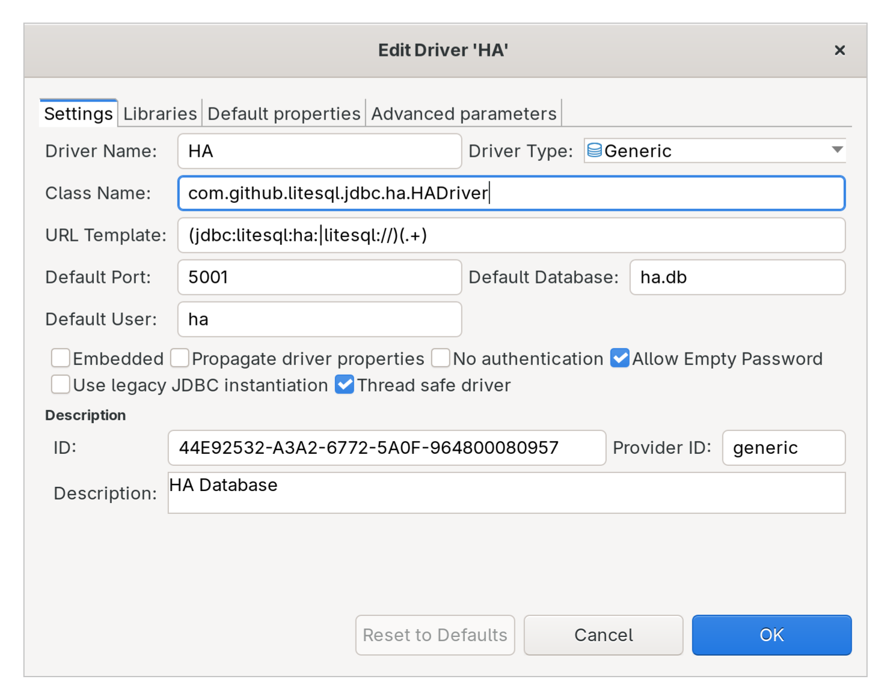

# jdbc-ha

A high-performance JDBC driver for [SQLite HA](https://github.com/litesql/ha) with built-in replication and failover support.

## Overview

`jdbc-ha` is a JDBC driver that brings enterprise-grade high availability to SQLite databases. It seamlessly integrates with existing JDBC applications while providing automatic failover, embedded replicas for read optimization, and replication support through NATS messaging.

## Features

- **High Availability**: Automatic failover and connection recovery for uninterrupted database access
- **Embedded Replicas**: Download and query read-only replicas locally for improved read performance
- **Replication Support**: Real-time synchronization using NATS messaging
- **JDBC Compatibility**: Drop-in replacement for standard JDBC drivers
- **Lightweight**: Minimal overhead with efficient resource usage
- **Easy Integration**: Simple setup with Maven or Gradle

## Installation

### Maven

Add the dependency to your `pom.xml`:

```xml
<dependencies>
    <dependency>
        <groupId>io.github.litesql</groupId>
        <artifactId>jdbc-ha</artifactId>
        <version>1.1.2</version>
    </dependency>
</dependencies>

<repositories>
    <repository>
        <name>Buf Maven Repository</name>
        <id>buf</id>
        <url>https://maven.buf.build</url>
    </repository>
</repositories>
```

### Gradle

Add to your `build.gradle`:

```gradle
dependencies {
    implementation 'io.github.litesql:jdbc-ha:1.1.2'
}

repositories {
    mavenCentral()
    maven {
        name = "buf"
        url = "https://maven.buf.build"
    }
}
```


## Quick Start

### 1. Start the HA Server

[Download the HA server](https://litesql.github.io/ha/downloads/) compatible with your operating system.

```sh
ha mydatabase.sqlite
```

### 2. Create a DataSource

Configure the `HADataSource` in your application:

```java
HADataSource dataSource = new HADataSource();
dataSource.setUrl("litesql://localhost:8080");
```

### 3. Execute Queries

```java
Connection connection = dataSource.getConnection();
Statement statement = connection.createStatement();
ResultSet resultSet = statement.executeQuery("SELECT * FROM users");

while (resultSet.next()) {
    // Process results
}

connection.close();
```

## Advanced Configuration

### Using Embedded Replicas for Read Optimization

Embedded replicas allow you to download and query read-only copies of your database locally, improving read performance. All write operations are automatically routed to the HA server.

```java
String replicaDir = "/path/to/replicas";

// Download replicas from the HA server
HAClient client = new HAClient(
    new URL("http://localhost:8080"), 
    "your-secret-key", 
    false
);
client.downloadAllCurrentReplicas(replicaDir, true);

// Configure the DataSource to use embedded replicas
HADataSource dataSource = new HADataSource();
dataSource.setUrl("litesql://localhost:8080");
dataSource.setEmbeddedReplicasDir(replicaDir);
dataSource.setReplicationURL("nats://localhost:4222");
dataSource.setReplicationDurable("unique_replica_name");
```

**Benefits:**
- Faster read queries by querying local replicas
- Reduced network latency
- Automatic synchronization via NATS
- Write operations still go through the central HA server for consistency

## DBeaver Integration

To manage your SQLite HA database using DBeaver:

1. [Download](https://github.com/litesql/jdbc-ha/releases) the full JAR file
2. Open DBeaver and go to **Database → New Database Connection**
3. Configure the custom driver following [DBeaver's driver setup guide](https://dbeaver.com/docs/dbeaver/Driver-Manager/#add-a-new-driver)
4. Use the configuration shown below:



## Additional Resources

- [SQLite HA GitHub Repository](https://github.com/litesql/ha)
- [JDBC API Documentation](https://docs.oracle.com/javase/8/docs/technotes/guides/jdbc/)
- [DBeaver Documentation](https://dbeaver.com/docs/)
- [NATS Messaging](https://nats.io/)

## Troubleshooting

### Connection Issues

If you're unable to connect to the HA server:
- Verify the HA server is running on the specified host and port
- Check network connectivity and firewall rules
- Ensure the URL format is correct: `litesql://hostname:port`

### Replica Synchronization

If replicas are not syncing:
- Verify the NATS server is running at the configured `replicationURL`
- Check that the `replicationDurable` name is unique across your application instances
- Ensure the HA server has appropriate permissions to write to the replica directory

## Documentation

For more detailed information, visit the [SQLite HA official documentation](https://github.com/litesql/ha).

## Contributing

Contributions are welcome! Please open an issue or submit a pull request.

## License

This project is licensed under the Apache v2 License - see the [LICENSE](LICENSE) file for details.
